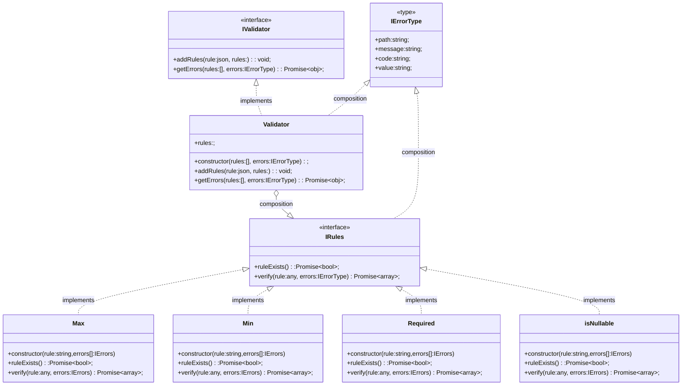

## Client usage

```ts
const validator = new Validator();
app.use(validator);
// Add new rules in routes
const addRules = validator.addRules(newRules: json);
app.post('/newEndpoint', addRules(rules), constroller );
const errors = validator.getErrors;
```


