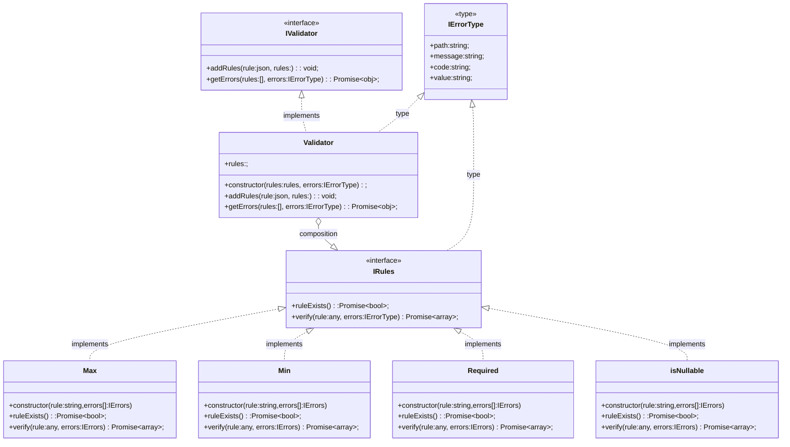

## Client usage

```ts
const validator = new Validator();
// Use this App level
app.use(validator);

// Add new rules and mapping it with route levels.
const addnewEndpointRules = validator.addRules(newRules: json); // return validator.getErrors
`POST_RULES:addnewEndpointRules`
app.post('/newEndpoint', constroller );
```


